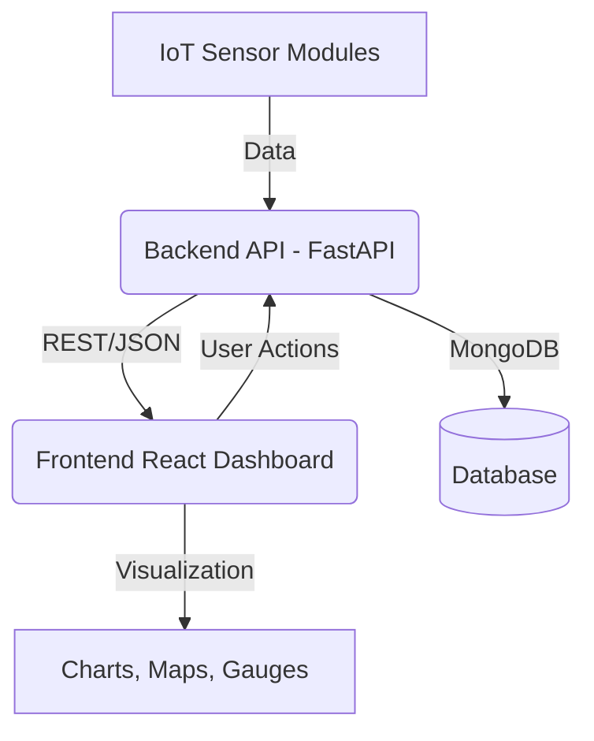

<p align="center">
  
</p>

<h1 align="center" style="font-size:3rem; font-family:Montserrat, Poppins, Inter, Arial, sans-serif; color:#22d3ee; text-shadow:0 2px 16px #22d3ee80;">AquaVigil 💧</h1>

<p align="center" style="font-size:1.2rem; color:#bae6fd;">
<b>Solar-powered IoT Water Quality & Distribution Monitoring Platform</b>
</p>

<p align="center">
  
</p>

---

## 🌊 Overview

AquaVigil is a next-generation, solar-powered IoT platform for real-time water quality and distribution monitoring. It empowers communities and utilities to ensure clean, efficient, and accountable water supply using advanced sensors, cloud analytics, and a beautiful, modern dashboard.

---

## 🚀 Features

- **Live Water Quality Monitoring:** pH, TDS, temperature, water level, and flow rate sensors
- **Real-Time Map & Dashboard:** Interactive map and statistics for all modules
- **Premium Dark UI:** Modern, animated, and visually stunning React + Tailwind dashboard
- **History & Analytics:** Access module history, trends, and system health
- **Contact & Reporting:** Built-in contact form and PDF report downloads
- **Cloud-Ready Backend:** FastAPI, MongoDB, and scalable cloud deployment
- **Solar-Powered IoT:** Designed for remote, off-grid water infrastructure

---

## 🏗️ Architecture



---

## 🛠️ Tech Stack

**Frontend:**

- React 19, React Router, Chart.js, React-Leaflet, Tailwind CSS, modern fonts (Inter, Poppins, Montserrat)

**Backend:**

- FastAPI, Pydantic, MongoDB (via Motor), JWT Auth, RESTful API

**DevOps:**

- Docker-ready, Uvicorn, Python 3.11+, dotenv, Pytest, Black, isort

---

## 📸 Screenshots

<p align="center">
  
  <br>
  
</p>

---

## ⚡ Quickstart

### 1. Clone the Repo

```bash
git clone https://github.com/Sampreeth3217/AquaVigil.git
cd AquaVigil
```

### 2. Backend Setup

```bash
cd backend
python -m venv venv
venv\Scripts\activate  # On Windows
pip install -r requirements.txt
uvicorn server:app --reload
```

### 3. Frontend Setup

```bash
cd ../frontend
yarn install  # or npm install
yarn start    # or npm start
```

### 4. Access the App

- Frontend: [http://localhost:3000](http://localhost:3000)
- Backend API: [http://localhost:8001/docs](http://localhost:8001/docs)

---

## 📦 Project Structure

```text
AquaVigil/
├── backend/         # FastAPI backend
│   ├── server.py    # Main API server
│   └── ...
├── frontend/        # React + Tailwind frontend
│   ├── src/
│   ├── public/
│   └── ...
├── tests/           # Test scripts
├── README.md
└── ...
```

---

## 🧑‍💻 Authors & Credits

- **N. Sampreeth Chowdary** – Project Lead, Full-Stack & IoT
- **G. Gowtham Chowdary** – Full-Stack & IoT
- **P. Sai Advaith** – Data Science & Analytics
- **K. Sai Lalith** – Cloud Solutions
- **Venkata Ruthvik Mundlamudi** – QA/Test

---

## 🤝 Contact & Support

- Email: info@aquavigil.com | aquavigil@gmail.com
- Emergency: +91 9988994648
- [Contact Form](http://localhost:3000/contact)

---

<p align="center" style="color:#bae6fd; font-size:1.1rem;">Made with 💧 by the AquaVigil Team</p>
